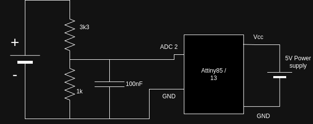
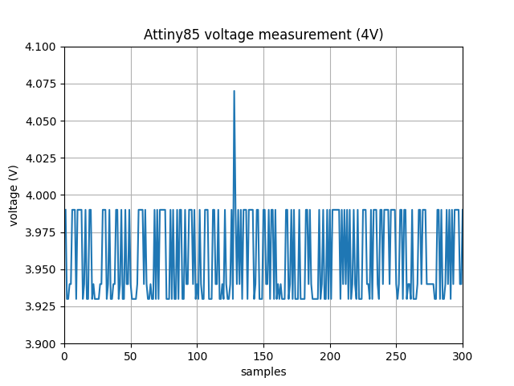
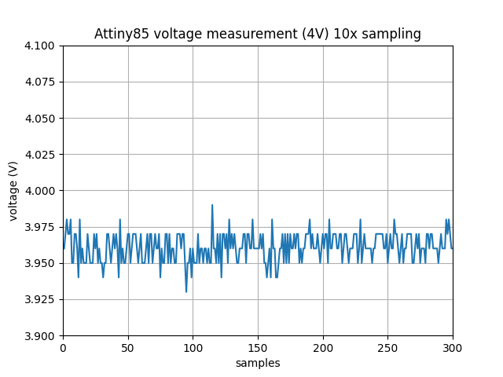
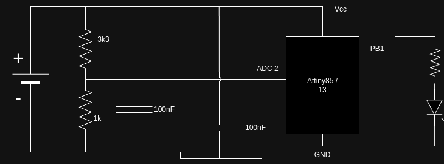

# attiny-voltmeter
measuring voltage using attiny13 and attiny85

### Motivation
Recently I bought a BMS to use in my future project (PicoWeatherStationV3 forshadowing) to protect its spare power supply, this cheap 1S boards have one critical flaw, battery low voltage cutoff is 2.5V (lowest safe voltage for 18650 lipol battery is around 3.1V), without way to change it (at least I don't know any). 

I thought to myself I can build simple one myself, all I need is Mosfet trasnsitor, some fuses and a way to control Mosfet basing on current battery voltage. In the past I built voltmeter using RaspberryPi Pico + LM4040, but for this application this setup is too expensive + takes too much space.

My final choice was Attiny13/Attiny85 as it is relative cheap, small and works in followign voltage ranges (2.7-5.5) so it can be powered directly from battery without using voltage stabilizer or buck/boost converter.

I got mysefl USBasp programmer + Attiny13 and Attiny85 (to test which one fits better), wired prototype board and I got to work.

### Uploading code
In order to upload code to Attiny I gonna use USBasp ISP programmer and Arduino IDE 2.3.2.

### Error with USB persmissions on Linux
If you encounter permission error while using USBasp programmer:

1. Create rule file.
```
touch /etc/udev/rules.d/99-usbasp.rules
```

2. put following content into it.
```
SUBSYSTEM=="usb", ATTRS{idVendor}=="16c0", ATTRS{idProduct}=="05dc", MODE="0666"
```

3. Relog (or reboot just in case).

### Setting fuses
Before first use (or after changing properties in `Tools` tab, I'm not sure about that) don't forget to set fuses by using `Burn Bootloader`.

### Attiny13 setup
For this little buddy I used following hardware package

```
https://github.com/MCUdude/MicroCore (version 2.4.0)
```

Installed by putting
```
https://mcudude.github.io/MicroCore/package_MCUdude_MicroCore_index.json
```

to `Additional Boards Manager URLs` in the IDE settings.

#### Serial monitor setup
Package by MCUdude comes with built in support for UART operations all we need is USB <---> UART converter (for example `PL2303`) and proper connection.

##### Wiring
| Converter  | Attiny13 |
| ---------- | -------- |
| RX         |     PB0  |
| TX         |     PB1  |

##### Baund rate
For this project I'm using `1.2 MHz` internal oscilator for which proper serial baundrate is `19200`.

#### Hello World
Alright with everything in place we can verify is everything is working as correctly.

1. Put following code into sketch.

```
void setup() {}

void loop() {
  while (true) {
    Serial.println("Hello world");
    delay(2000);
  }
}
```

2. Upload using Programmer.
```
Ctrl + Shift + U
```

And if you are the lucky one, you should see `Hello World` printing every 2 seconds. 

### Attiny85 setup
For Attiny85 I used following hardware package.

```
https://github.com/SpenceKonde/ATTinyCore (version 1.5.2)
```

Installed by putting
```
https://drazzy.com/package_drazzy.com_index.json
```

to `Additional Boards Manager URLs` in the IDE settings.

#### Serial monitor setup
Package by SpenceKonde comes with built in support for uart operations all we need is USB <---> UART converter (for example `PL2303`) and proper connection.

##### Wiring
| Converter  |   Attiny85    |
| ---------- | ------------- |
| RX         |     PB0       |
| TX         |   A1 / PB1    |

##### Baund rate
For this project I'm using `1 MHz` internal oscilator for which proper serial baundrate is `9600`.

#### Hello World
Alright with everything in place we can verify is everything is working as correctly.

1. Put following code into sketch.

```
void setup() {
  Serial.begin(9600);
}

void loop() {
  while (true) {
    Serial.println("Hello world");
    delay(2000);
  }
}
```

2. Upload using Programmer.
```
Ctrl + Shift + U
```

And if you are the lucky one, you should see `Hello World` printing every 2 seconds. 

### Attiny85 voltage measurements
I created following circuit with voltage divider in ratio 1:4.3 (1V on ADC pin = 4.3V of source voltage).



I hooked Attiny to UART converter (with power), switched ADC reference to internal 1.1V, set PSU to 4V and took some readings



It is quiet noisy, isn't it ? Let's check if it can be tweked with some sampling



Yup It helped now it looks much better

### Attiny13 voltage measurements
Attiny13 has 1Kb of internal space, too little for using ADC and Serail libs at the same time, so I had to figure out better way to test it.

### Field Test (Attiny85 and Attiny13)
I modified previous circuit, added LED to indicate if voltage is below certain threshold + powered Attiny directly from battery.



This way I can test if variable supply voltage can make readings worse.
I uploaded following sketches and tested it.

- [attiny13](/sketches/attiny13/attiny13.ino)
- [attiny85](/sketches/attiny85/attiny85.ino)

After some tests it looks like varibale supply voltage doesn't affect readings much it still works great.

### Summary
Attiny does a good job as a voltmeter, and it will be core part (Attiny85, because of bigger Flash size) of simple kind of BMS I talked about. 
